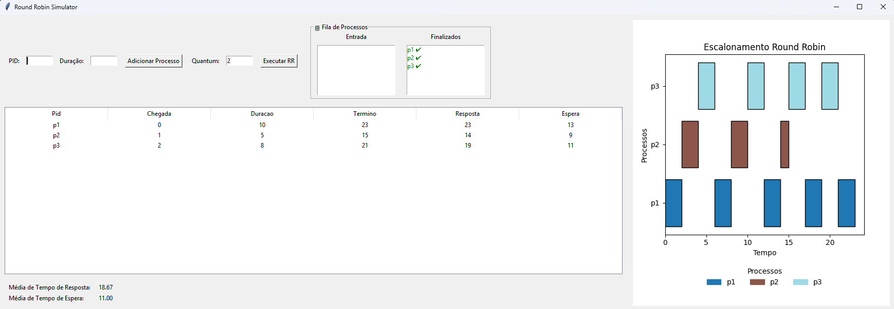

# Round Robin Simulator - Sistema de Escalonamento de Processos

## 1. Introdução

Este projeto implementa um **simulador de escalonamento de processos** utilizando o algoritmo **Round Robin (RR)**. Ele permite a análise do comportamento de múltiplos processos concorrentes na CPU, fornecendo métricas quantitativas de desempenho, como **tempo de resposta** e **tempo de espera**, além de uma representação visual do escalonamento por meio de um gráfico de Gantt.

O simulador é desenvolvido em Python, com interface gráfica em `tkinter` e gráficos gerados com `matplotlib`.

---

## 2. Algoritmo Round Robin

O **Round Robin** é um algoritmo de escalonamento de CPU baseado em **tempo compartilhado**:

- Cada processo recebe um **quantum de tempo** fixo.
- Se o processo não terminar dentro do quantum, ele retorna ao final da fila.
- É considerado **justo**, evitando que processos de longa duração monopolizem a CPU.
- É especialmente útil para sistemas interativos e de tempo compartilhado.

Matematicamente, para um processo \(P_i\) com tempo de burst \(B_i\) e tempo de chegada \(A_i\), temos:

- **Tempo de término:** \(T_i = t_{\text{final do último quantum do processo}}\)
- **Tempo de resposta:** \(R_i = T_i - A_i\)
- **Tempo de espera:** \(W_i = R_i - B_i\)

---

## 3. Estrutura do Sistema

O sistema possui:

1. **Fila de entrada:** Lista de processos a serem escalonados.
2. **Fila de finalizados:** Lista de processos já concluídos.
3. **Tabela de processos:** Exibe PID, tempo de chegada, duração, término, tempo de resposta e espera.
4. **Métricas de desempenho:** Mostra **média de tempo de resposta** e **média de tempo de espera**.
5. **Gráfico de Gantt:** Visualiza a execução dos processos com cores únicas por PID.
6. **Interface de usuário:** Permite adicionar processos, definir quantum e executar o algoritmo.

---

## 4. Funcionamento

### 4.1 Adição de Processos

Cada processo possui:
- **PID:** Identificador único.
- **Duração (Burst Time):** Tempo necessário para execução completa.

### 4.2 Execução do Round Robin

Defina o **quantum** desejado e execute o algoritmo. Os processos são escalonados ciclicamente até a finalização de todos.

### 4.3 Visualização

O resultado é apresentado de três formas:

1. **Tabela de Processos:** Exibe tempos de término, resposta e espera.
2. **Métricas:** Mostra as médias calculadas de tempo de resposta e espera.
3. **Gráfico de Gantt:** Demonstra a execução sequencial dos processos.

#### Exemplo de interface



---

## 5. Implementação

O sistema é estruturado em três módulos principais:

1. **`processo.py`**: Define a classe `Processo` com atributos de escalonamento.
2. **`round_robin.py`**: Implementa a função `RoundRobin`, retornando:
   - Linha do tempo (para Gantt)
   - Lista de processos atualizada com tempos de término, espera e resposta.
3. **`gui.py`**: Interface gráfica que:
   - Permite adicionar processos e definir quantum.
   - Exibe tabelas, listas de filas e métricas.
   - Desenha o gráfico de Gantt dinamicamente.

---

## 6. Instalação e Execução

### Requisitos

- Python 3.x
- Bibliotecas:
```bash
pip install matplotlib
```

## 7. Executar

```bash
python main.py
```

- Insira PID e duração dos processos.
- Defina o quantum.
- Clique em Adicionar Processo e depois Executar RR.
- Observe a tabela, as métricas e o gráfico de Gantt.
